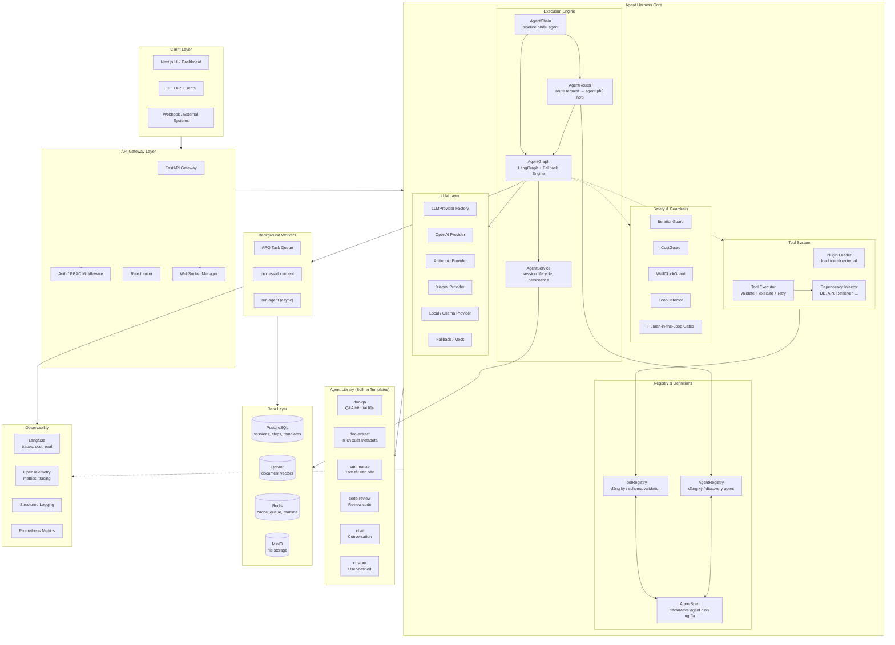
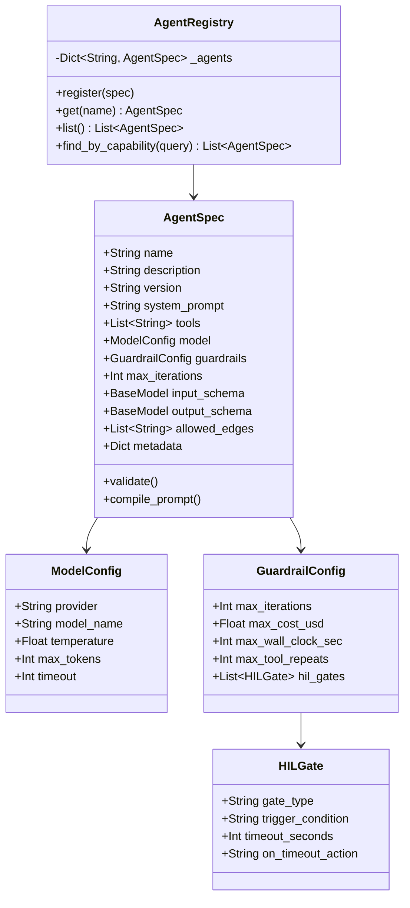
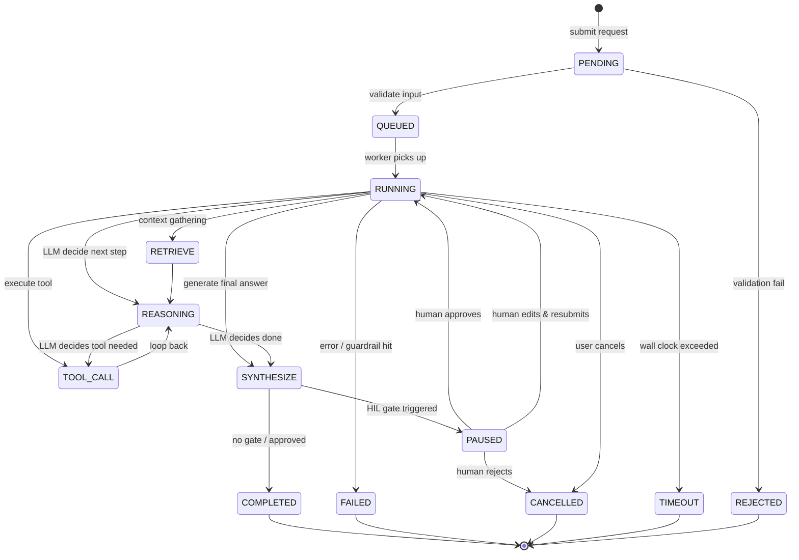
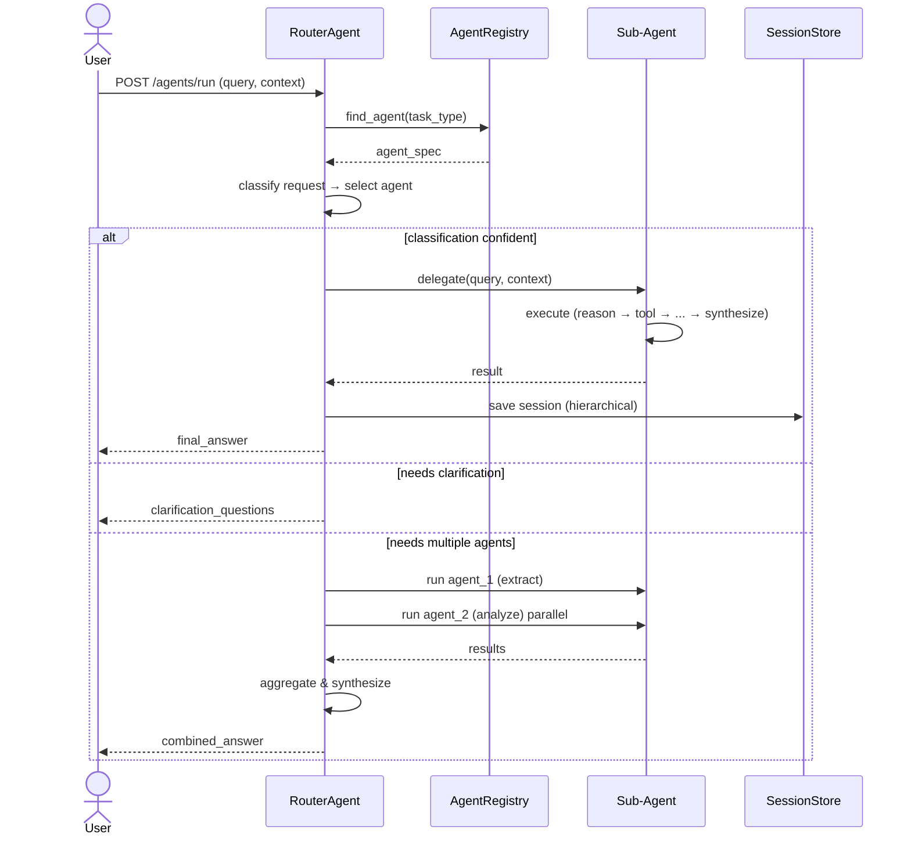
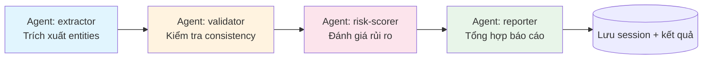
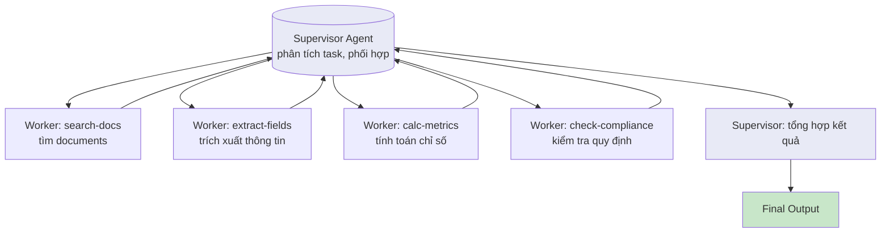
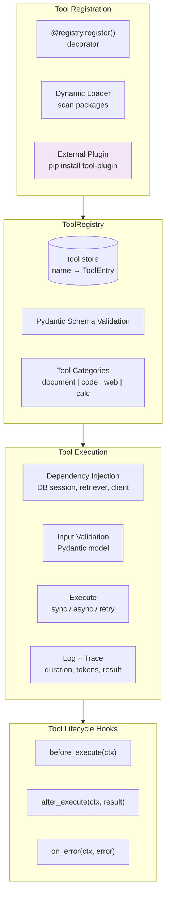
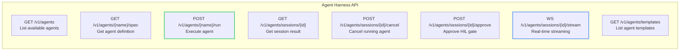
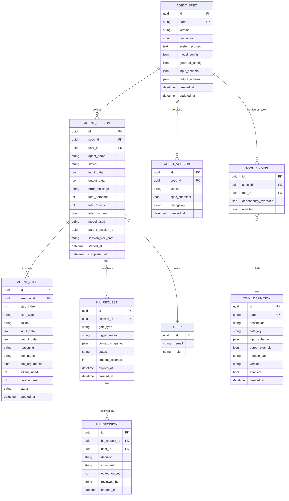
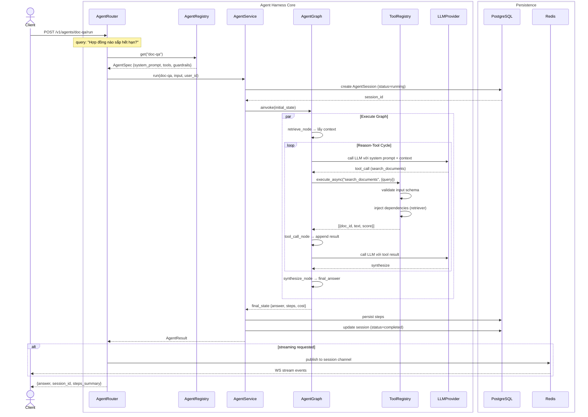

# Agent Harness — Kiến trúc hệ thống

> **Kiến trúc đã implement** — ✅ Phase 1 (Agent Harness Core) + ✅ Phase 2 (Multi-Agent Orchestration).
> Chi tiết tại [Implementation Notes](#12-implementation-notes).

---

## 1. Tổng quan System Architecture



---

## 2. Agent Definition Schema



---

## 3. Agent Lifecycle State Machine



---

## 4. Multi-Agent Orchestration Patterns

### 4.1 Router Agent Pattern



### 4.2 Agent Chain Pattern



### 4.3 Supervisor + Workers Pattern



---

## 5. Tool System Architecture



---

## 6. Generic Agent API Endpoints



---

## 7. Data Model (Persistence)



---

## 8. Flow xử lý request điển hình



---

## 9. Layer Hierarchy (Package Structure) — As-Built

```
backend/
├── app/
│   ├── harness/                      # Agent Harness Core (PHASE 1 ✅)
│   │   ├── __init__.py
│   │   ├── agent_spec.py             # AgentSpec, ModelConfig, GuardrailConfig
│   │   ├── agent_registry.py         # AgentRegistry singleton + discovery
│   │   ├── agent_graph.py            # Graph factory (LangGraph + fallback)
│   │   ├── multi_agent.py            # Router, Chain, Parallel patterns (PHASE 2 ✅)
│   │   ├── nodes/
│   │   │   ├── __init__.py
│   │   │   ├── reason.py             # make_reason_node
│   │   │   ├── tool_call.py          # make_tool_call_node
│   │   │   └── synthesize.py         # make_synthesize_node
│   │   └── safety.py                 # Guards, loop detector, cost tracker
│   │
│   ├── agents/                       # Agent Library
│   │   ├── agents/                   # Agent templates (4 built-in)
│   │   │   ├── __init__.py           # load_builtin_agents()
│   │   │   ├── doc_qa.py             # doc-qa template
│   │   │   ├── chat.py               # chat template
│   │   │   ├── summarise.py          # summarise template
│   │   │   └── router.py             # router template (PHASE 2 ✅)
│   │   ├── tools/                    # Tool system
│   │   │   ├── __init__.py
│   │   │   ├── registry.py           # ToolRegistry
│   │   │   ├── document_tool.py
│   │   │   ├── search_tool.py
│   │   │   └── delegate_tool.py      # delegate_to_agent (PHASE 2 ✅)
│   │   ├── state.py                  # AgentState
│   │   ├── safety.py                 # MaxIterationGuard, CostTracker, etc.
│   │   └── nodes/                    # (legacy, replaced by harness/nodes/)
│   │
│   ├── api/v1/
│   │   ├── agent.py                  # Agent API endpoints (PHASE 1+2 ✅)
│   │   ├── documents.py
│   │   └── ...
│   │
│   ├── services/
│   │   ├── agent_service.py          # AgentService (PHASE 1+2 ✅)
│   │   └── ...
│   │
│   ├── db/
│   │   ├── session.py                # get_async_session (PHASE 2 ✅)
│   │   ├── models/agent.py           # AgentSession + AgentStep
│   │   └── ...
│   │
│   ├── llm/                          # LLM abstraction
│   ├── rag/                          # Retrieval
│   └── ...
```

---

## 10. Technology Map

| Layer | Hiện tại | Nâng cấp | Status |
|-------|----------|----------|--------|
| **Agent Definition** | Hardcoded trong graph nodes | `AgentSpec` declarative, Pydantic-validated | ✅ |
| **Agent Registry** | Không có | `AgentRegistry` singleton + discovery API | ✅ |
| **Graph Engine** | LangGraph + Fallback (1 graph) | Generic `AgentGraph`, agent-specific graphs | ✅ |
| **Tool System** | Singleton `ToolRegistry`, 2 tools | Plugin system, categories, DI, lifecycle hooks | ⏳ Phase 3 |
| **Multi-Agent** | Không | Router, Chain, Supervisor-Workers patterns | ✅ Router+Chain+Parallel |
| **State Schema** | `AgentState` có `documents` field | `BaseAgentState` + per-agent context extension | ✅ |
| **Human-in-Loop** | Không | `HILGate` với approve/reject/edit API | ❌ Chưa có |
| **API** | Document-specific endpoints | Generic `/agent/*` endpoints | ✅ |
| **Session** | DB lưu steps | Hierarchical sessions, session tree | ⏳ |
| **Streaming** | HTTP response | WebSocket real-time stream | ❌ Chưa có |
| **Templates** | Không | Built-in: doc-qa, chat, summarise, router | ✅ |
| **Plugins** | Không | External tool/agent loading | ❌ Chưa có |

---

## 11. Key Design Decisions

| Decision | Lựa chọn | Lý do |
|----------|----------|-------|
| Agent định nghĩa bằng code (decorator) thay vì YAML/JSON | **Python DSL** | Type safety, IDE autocomplete, dễ test, tận dụng Pydantic |
| Graph engine: LangGraph ưu tiên, fallback state machine | **Hybrid** | Không ép dependency; production dùng LangGraph, dev/test dùng fallback |
| Tool dependency injection | **Factory function** (`create_bound_*`) | Pattern hiện tại đã đúng, chỉ cần generalize |
| Agent session tree | **Parent-child với path** | Cho phép trace agent nào gọi agent nào |
| HIL timeout | **Configurable + fallback action** | Không block system vô thời hạn |
| Plugin system | **Entry-point based** (Python namespace) | Tương tự pytest plugins, không cần thêm framework |

---

> **Document này là architecture blueprint.** Các mục đã implement được đánh dấu ✅ trong Technology Map và Implementation Notes bên dưới.

---

## 12. Implementation Notes

### Phase 1 — Agent Harness Core (Implemented ✅)

| Component | File | Status |
|-----------|------|--------|
| `AgentSpec` + factory methods | `app/harness/agent_spec.py` | ✅ |
| `AgentRegistry` singleton | `app/harness/agent_registry.py` | ✅ |
| `build_agent_graph()` (LangGraph + fallback) | `app/harness/agent_graph.py` | ✅ |
| Reason node (`make_reason_node`) | `app/harness/nodes/reason.py` | ✅ |
| Tool call node (`make_tool_call_node`) | `app/harness/nodes/tool_call.py` | ✅ |
| Synthesize node (`make_synthesize_node`) | `app/harness/nodes/synthesize.py` | ✅ |
| Agent templates (doc-qa, chat, summarise) | `app/agents/agents/` | ✅ |
| `AgentState` with context field | `app/agents/state.py` | ✅ |
| `AgentService.run_agent()` + legacy `run()` | `app/services/agent_service.py` | ✅ |
| API endpoints + lifespan loading | `app/api/v1/agent.py` + `app/main.py` | ✅ |

### Phase 2 — Multi-Agent Orchestration (Implemented ✅)

| Component | File | Status |
|-----------|------|--------|
| `delegate_to_agent` tool | `app/agents/tools/delegate_tool.py` | ✅ |
| `get_async_session` context manager | `app/db/session.py` | ✅ |
| `MultiAgentRouter` (keyword + LLM classification) | `app/harness/multi_agent.py` | ✅ |
| `AgentChain` (sequential pipeline) | `app/harness/multi_agent.py` | ✅ |
| `ParallelAgentGroup` (concurrent fan-out) | `app/harness/multi_agent.py` | ✅ |
| Router agent template | `app/agents/agents/router.py` | ✅ |
| API: `POST /agent/chain/run` | `app/api/v1/agent.py` | ✅ |
| API: `POST /agent/parallel/run` | `app/api/v1/agent.py` | ✅ |
| API: `POST /agent/route/run` | `app/api/v1/agent.py` | ✅ |
| `AgentService.run_chain()` | `app/services/agent_service.py` | ✅ |

### Deviations from Original Plan

| Planned | Actual | Reason |
|---------|--------|--------|
| `app/harness/agent_router.py` | `app/harness/multi_agent.py` (consolidated) | Cleaner single file for all orchestration patterns |
| `app/harness/agent_chain.py` | Inside `multi_agent.py` | Less file sprawl |
| `/v1/agents/*` endpoints | `/agent/*` | Simpler routing, consistent with existing pattern |
| 5 built-in agents | 4 (doc-qa, chat, summarise, router) | doc-extract not yet needed; router added |
| HIL gates, WebSocket streaming, Plugin system | Not implemented (Phase 3+) | Out of scope for initial implementation |
